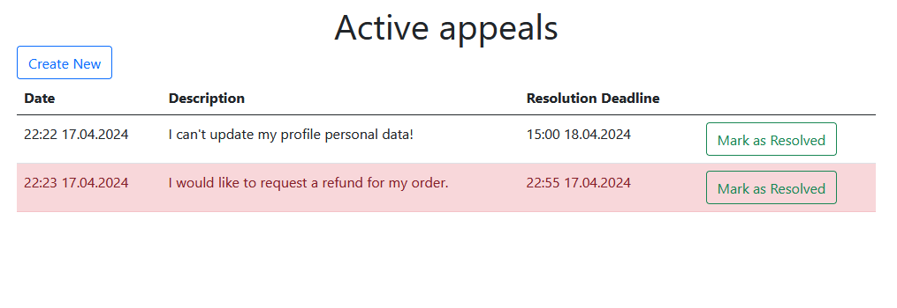

# Appeals Management System

This web application provides a simple interface for managing user support appeals. It allows users to enter, view, and manage appeals.

## Features

- **Appeal Submission**: Users can submit appeals with description and resolution deadline. Other fields are filled automatically.
- **Display of Appeals**: Appeals are displayed in a list, sorted in descending order by the resolution deadline.
- **Highlighting Urgent Appeals**: Appeals with less than 1 hour remaining until the resolution deadline, or which have already exceeded the deadline, are highlighted in red.
- **Resolution of Appeals**: Users can mark appeals as resolved, which will then remove them from the active list.

## Testing

The server-side functionality of the application is tested in the `Tests/Controllers/AppealsControllerTests.cs` file.

## Preview

- **Creating new appeal**

- **List of active appeals**

